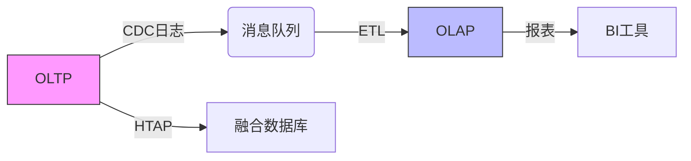

# OLAP

以下是OLAP（联机分析处理）与OLTP（联机事务处理）的详细对比，从设计目标到技术实现的全方位解析，结合具体案例说明其区别和联系：

---

**一、核心定位对比**
| 维度       | OLTP系统                | OLAP系统                |
|----------------|----------------------------|----------------------------|
| 核心目标   | 支撑实时业务操作（增删改查） | 支持复杂分析决策（统计预测） |
| 典型场景   | 电商下单、银行转账          | 销售趋势分析、用户画像建模  |
| 数据时效   | 当前最新状态（秒级延迟）    | 历史快照（T+1或小时级延迟） |

案例说明：  
• 用户在淘宝下单（OLTP） → 生成订单记录到MySQL  

• 运营分析双11销售趋势（OLAP） → 从数据仓库（如Hive）查询聚合结果  


---

**二、数据模型差异**
| 维度       | OLTP系统                | OLAP系统                |
|----------------|----------------------------|----------------------------|
| 建模方法   | 关系模型（3NF规范化）       | 星型/雪花模型（维度建模）  |
| 表结构     | 高度规范化（多表关联）      | 宽表冗余（减少JOIN）       |
| 数据粒度   | 原子操作记录（单条订单）    | 聚合指标（每日销售额）      |

技术细节：  
• OLTP的3NF：订单表拆分为`orders`、`order_items`、`users`等，避免冗余  

• OLAP的星型模型：`fact_sales`事实表直接关联`dim_product`、`dim_time`等维度表  


---

**三、存储与访问优化**
| 维度       | OLTP系统                | OLAP系统                |
|----------------|----------------------------|----------------------------|
| 存储格式   | 行存储（MySQL B+Tree）      | 列存储（Parquet/ORC）      |
| 索引策略   | B-Tree/Hash（点查询优化）   | 位图索引（高效过滤）       |
| 压缩方式   | 低压缩率（需快速写入）      | 高压缩率（节省存储）       |

性能对比实验：  
```sql
-- OLTP查询（行存储高效）
SELECT * FROM orders WHERE order_id = 10086; -- 0.1ms

-- OLAP查询（列存储高效）
SELECT SUM(revenue) FROM sales WHERE year = 2023; -- 行存储:10s vs 列存储:0.2s
```

---

**四、事务与一致性**
| 维度       | OLTP系统                | OLAP系统                |
|----------------|----------------------------|----------------------------|
| 事务特性   | 强ACID（原子性/一致性）     | 最终一致性（BASE原则）     |
| 锁粒度     | 行级锁（高并发控制）        | 表级锁（批量导入）         |
| 并发场景   | 短事务（<100ms）            | 长查询（分钟级）           |

典型问题：  
• OLTP：双11秒杀需处理库存超卖（用`SELECT FOR UPDATE`+行锁）  

• OLAP：分析师查询不影响数据导入（用MVCC多版本控制）  


---

**五、系统架构设计**
| 维度       | OLTP系统                | OLAP系统                |
|----------------|----------------------------|----------------------------|
| 扩展方式   | 垂直扩展（更强单机）        | 水平扩展（MPP集群）        |
| 硬件优化   | 高主频CPU+低延迟SSD         | 多核CPU+大内存+高吞吐HDD   |
| 典型组件   | MySQL/Oracle               | Redshift/Snowflake         |

现代架构演进：  
• HTAP融合：TiDB通过Raft协议实现OLTP+Region分组处理OLAP  

• 云原生方案：AWS Aurora（OLTP）与Redshift Spectrum（OLAP）联动  


---

**六、联系与协同**
虽然设计差异大，但二者在实际系统中紧密协作：  
1. 数据流向：OLTP → CDC日志（如Kafka） → ETL → OLAP  
   • 案例：MySQL Binlog → Flink → Hive  

2. 混合查询：  
   • 实时分析：OLTP数据通过物化视图同步到OLAP（如Oracle Materialized Views）  

3. 新型系统：  
   • ClickHouse支持实时插入（类OLTP）+列存分析（OLAP）  


---

**七、教学案例设计**
课堂讨论题：  
*"假设要为滴滴设计司机调度系统：*  
1. *司机接单时如何保证事务一致性？（OLTP设计）*  
2. *分析城市热力图时如何优化查询？（OLAP设计）*  
3. *如何让两个系统数据同步？"*  

参考答案：  
1. OLTP：用GeoHash分库分表+乐观锁防止重复接单  
2. OLAP：将GPS轨迹聚合成网格单元，预计算热力值  
3. 同步：通过Kafka连接Flink实时处理订单状态变更  

---

**八、总结图谱**


通过这种结构化对比，学生能清晰理解二者如何各司其职又协同工作，为后续讲解数据仓库分层（ODS/DWD/DWS）打下基础。
